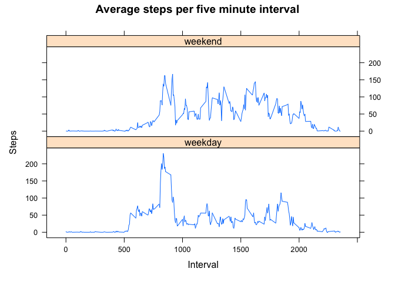

```r
library(data.table)
library(dplyr)
library(lubridate)
library(ggplot2)
library(lattice)
```

This assignment makes use of data from a personal activity monitoring device. This device collects data at 5 minute intervals through out the day. The data consists of two months of data from an anonymous individual collected during the months of October and November, 2012 and include the number of steps taken in 5 minute intervals each day.

## Loading and preprocessing the data

Activity monitoring data is stored in a file called "activity.csv", which contains variable:
- steps: Number of steps taking in a 5-minute interval (missing values are coded as NA)
- date: The date on which the measurement was taken in YYYY-MM-DD format
- interval: Identifier for the 5-minute interval in which measurement was taken. Interval resets at the end of every day.

The code chunk below reads csv file and coverts data to data.table format.


```r
# import activity data and covert to data.table
act <- read.csv("activity.csv") %>% as.data.table()

# convert date column from character to date object
act$date <- ymd(act$date)
```


## What is mean total number of steps taken per day?

The code chunks below makes a histogram of the total number of steps taken each day and calculates the mean and median total number of steps taken per day. Missing values are ignored.


```r
# calculate the total number of steps taken per day
act.sum <- act %>%
  group_by(date) %>% 
  summarize(sum.steps = sum(steps, na.rm = TRUE))

hist(act.sum$sum.steps, 
     main = "Histogram of total steps per day",
     ylab = "Frequency",
     xlab = "Steps per day")
```

<!-- -->


```r
mean.total <- mean(act.sum$sum.steps)
print(paste("The mean number of steps per day is",  round(mean.total)))
```

```
## [1] "The mean number of steps per day is 9354"
```


```r
median.total <- median(act.sum$sum.steps)
print(paste("The median number of steps per day is",  round(median.total)))
```

```
## [1] "The median number of steps per day is 10395"
```


## What is the average daily activity pattern?

The code chunks below make a time series plot of the 5 minute interval and the average number of steps taken during that interval averaged across all days and finds the interval with the maximum number of steps on average.


```r
# calculate the average number of steps taken per interval over all days
time.series <- act %>%
  group_by(interval) %>% 
  summarize(avg.steps = mean(steps, na.rm = TRUE))

ggplot(data = time.series, aes(x = interval, y = avg.steps)) +
  geom_line(color = "blue") +
  xlab("Interval") + ylab("Steps") + 
  ggtitle("Average steps per five minute interval") +
  theme(axis.text = element_text(size = 14), 
        axis.title = element_text(size = 16),
        plot.title = element_text(size = 18),
        legend.text = element_text(size = 14))
```

<!-- -->


```r
# Which interval has the maximum number of steps on average?
max.int <- time.series$interval[which.max(time.series$avg.steps)]
print(paste("The interval with the maximum average number of steps is",  max.int))
```

```
## [1] "The interval with the maximum average number of steps is 835"
```

## Imputing missing values

Note that there are a number of days/intervals where there are missing values (coded as NA). The presence of missing days may introduce bias into some
calculations or summaries of the data.

The code chunk below calculates the number of missing values:


```r
num.na <- sum(is.na(act$steps))
print(paste("The number of missing values is",  num.na))
```

```
## [1] "The number of missing values is 2304"
```

To fill in the missing values we will assume that activity pattern are roughly similar between days, so we will replace each NA in the original dataset with the mean number of steps over all days for that interval.


```r
# Loop through rows. If steps is NA, get the average steps from the time series for the corresponding interval
act.comp <- act
for (i in 1:length(act$steps)) {
  if (is.na(act$steps[i])) {
    int <- act$interval[i]
    act.comp$steps[i] <- time.series$avg.steps[time.series$interval == int]
  } else {
    act.comp$steps[i] <- act$steps [i]
  }
}
```

Make a histogram of the total number of steps taken each day and Calculate and report the mean and median total number of steps taken per day. Do these values differ from the estimates from the first part of the assignment? What is the impact of imputing missing data on the estimates of the total daily number of steps?


```r
# calculate the total number of steps taken per day
act.comp.sum <- act.comp %>%
  group_by(date) %>% 
  summarize(sum.steps = sum(steps))

hist(act.comp.sum$sum.steps, 
     main = "Histogram of total steps per day, no missing values",
     ylab = "Frequency",
     xlab = "Steps per day")
```

<!-- -->

We can see that the histogram appears very different. There are fewer days with a very small number of steps and more days with a number of steps that is closer to the center of the distribution. The distribution looks more symmetrical.

Does filling in missing values change the median and mean?


```r
mean.total <- mean(act.comp.sum$sum.steps)
print(paste("The mean number of steps per day is",  round(mean.total)))
```

```
## [1] "The mean number of steps per day is 10766"
```


```r
median.total <- median(act.comp.sum$sum.steps)
print(paste("The median number of steps per day is",  round(median.total)))
```

```
## [1] "The median number of steps per day is 10766"
```

With the missing values replaced, the value of the mean is much higher (because it is not being thrown off by all of the low numbers). Also, the mean and median are now the same, which is characteristic of a symmetrical distribution.


## Are there differences in activity patterns between weekdays and weekends?

The code chunk below creates a new factor variable in the dataset with two levels – “weekday” and “weekend” indicating whether a given date is a weekday or weekend day.


```r
# Make a new column to hold days of the week and a new column for weekends vs. weekdays
act.comp$day <- weekdays(act.comp$date, abbreviate = TRUE)
act.comp$is.weekend <- rep("weekday")
act.comp$is.weekend[act.comp$day == "Sat" | act.comp$day == "Sun"] <- "weekend"
```

The code chunk below makes a panel plot with two time series plots, one averaged across all weekend days and the other averaged across all weekday days. The x-axes are the five minute interval and the y-axes are the average number of steps.


```r
# calculate the average number of steps taken per interval over all days
# separating weekends and weekdays
time.series <- act.comp %>%
  group_by(interval, is.weekend) %>% 
  summarize(avg.steps = mean(steps, na.rm = TRUE))
```

```
## `summarise()` has grouped output by 'interval'. You can override using the `.groups` argument.
```

```r
xyplot(avg.steps ~ interval | is.weekend, data = time.series,
       type = "l",
       layout = c(1,2),
       main="Average steps per five minute interval",
       ylab="Steps", xlab="Interval")
```

<!-- -->

Differences between weekday and weekend pattern - There is a prominent peek near the beginning of the day on weekdays that is not there on the weekends. Overall the weekend pattern looks more even throughout the day. Perhaps this person gets more consistent physical activity throughout the day on weekends and only walks early in the day on weekdays.
